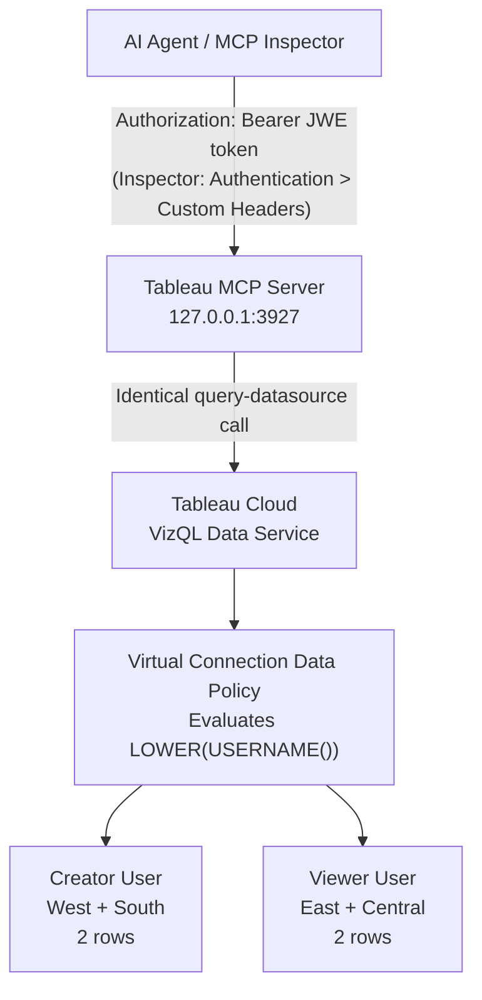

# Tableau MCP — Row-Level Security: End-to-End Reproduction Guide

> **What this proves:** Two people send identical questions to an AI assistant connected to
> Tableau. They get different answers. Not because the application filtered the data. Because
> Tableau Cloud enforced your security policy at the data layer — before any result left the
> server.
>
> This guide takes you from a blank Tableau Cloud site to a working, verified RLS demonstration
> in a local MCP environment. Every step is reproducible. Every failure mode is documented.

---

## Who This Guide Is For

This guide is written for a **Tableau-connected SE, technical architect, or advanced customer**
who wants to reproduce the RLS simulation in their own Tableau Cloud environment. You will need:

- Tableau Cloud Manager (TCM) **cloud administrator** access
- Tableau Cloud **site Creator or Administrator** role
- Node.js 22.7.5 or later
- This repository cloned locally

You do not need Tableau Desktop. The Virtual Connection and Data Policy are configured entirely
in the Tableau Cloud browser UI.

---

## What You Will Have at the End

| Capability | Detail |
|------------|--------|
| Two Tableau Cloud users | Creator → sees West + South; Viewer → sees East + Central |
| Virtual Connection with Data Policy | `USERNAME()` condition enforces per-user row access |
| Local MCP server (UAT auth) | Running on `http://127.0.0.1:3927` |
| Verified RLS proof | Same query, two users, different data — automated and manual |

---

## Architecture Overview

> Public copies of this repository exclude generated report artefacts under `uat/reports/`.
> The diagram below is the canonical reference for the flow.



The MCP server sends identical queries for every user. All filtering happens inside Tableau's
Virtual Connection engine, which maintains the authenticated user identity through every
VizQL Data Service call.

---

## Part 1 — Tableau Cloud Setup

### Step 1.1 — Create Two Demo Users

In **Tableau Cloud → Users → Add Users**, create the following accounts (or use existing ones
you will map in the Data Policy):

| User | Suggested email pattern | Tableau site role |
|------|------------------------|-------------------|
| Creator demo user | `creator-user@example.com` | **Creator** |
| Viewer demo user | `viewer-user@example.com` | **Viewer** |

> **Datasource permission requirement:** VizQL Data Service queries require **API Access** on the
> published datasource (View + Connect + API Access). Without API Access, queries return 0 rows
> with no error. A Viewer site role user can return rows successfully if API Access is granted.

Record both email addresses. You will use them in the Virtual Connection Data Policy (Step 1.3)
and in `tests/.env` (Step 2.4).

---

### Step 1.2 — Create a Virtual Connection

A Virtual Connection is the Tableau object that enables Data Policies. You cannot apply a Data
Policy to a regular published datasource.

1. In Tableau Cloud, go to **Explore → New → Virtual Connection**
2. Connect to your data source (the Superstore data is built into Tableau Cloud as a sample —
   connect to **Tableau Samples → Superstore** if available, or connect to any data source
   you have access to)
3. In the Virtual Connection editor, add the **Orders** table (or equivalent table containing
   the column you want to filter on — `Region` in this example)
4. Click **Publish** → name it something recognisable, e.g. `Superstore with RLS Policies`
5. Note the name — you will create a datasource from it in Step 1.4

> **Why a Virtual Connection?** `USERNAME()` inside a regular calculated field datasource
> filter returns `null` through the VizQL Data Service API — all users get 0 rows. Only a
> Virtual Connection Data Policy evaluates `USERNAME()` server-side with the correct
> authenticated user context. See the comparison table at the end of this section.

<figure>
  
  <figcaption><em>The completed Virtual Connection configuration: the <strong>Data Policies (1)</strong> tab is active, the <code>rls_entitlement</code> policy maps <strong>Orders → Region</strong> as the policy column, and the <code>LOWER(USERNAME())</code> condition is set for both users. The <strong>Viewer Demo</strong> preview at the bottom confirms the policy is live — 5,321 of 10,194 rows are returned, not the full dataset.</em></figcaption>
</figure>

---

### Step 1.3 — Configure the Data Policy

Still inside the Virtual Connection editor (or re-open it via **Tableau Cloud → Virtual Connections**):

1. Click the **Data Policies** tab
2. Click **New Policy** → name it `rls_entitlement`
3. In **Step 1: Add tables and columns to map**, select the **Orders** table and add **Region**
   as the policy column

4. In **Step 2: Write a policy condition**, enter the following, replacing the email addresses
   with your actual user emails:

```sql
(
  LOWER(USERNAME()) = 'creator-user@example.com'
  AND (
    [Region] = 'West'
    OR [Region] = 'South'
  )
)
OR
(
  LOWER(USERNAME()) = 'viewer-user@example.com'
  AND (
    [Region] = 'East'
    OR [Region] = 'Central'
  )
)
```

5. Confirm **"Calculation is valid"** appears below the editor
6. Click **Save**, then **Publish** the Virtual Connection

> **Why `LOWER(USERNAME())`?** Tableau Cloud usernames are email addresses. Some identity
> providers pass the email in mixed case. `LOWER()` ensures the match is case-insensitive.
> Using `USERNAME()` directly is safe if you can guarantee consistent case, but `LOWER()` is
> more robust for customer environments.

---

### Step 1.4 — Publish a Datasource Through the Virtual Connection

The demo datasource must connect through your Virtual Connection — not directly to the
underlying database.

1. In Tableau Cloud, go to **Explore → New → Published Data Source**
2. Connect to **your Virtual Connection** (search by name under the Virtual Connections tab)
3. Select the **Orders** table
4. Click **Publish** → name it `Sample - Superstore with VC policies`
5. Note the datasource LUID — go to the datasource page, and copy the ID from the URL:
   `https://<pod>.online.tableau.com/#/site/<site>/datasources/<LUID>/details`

Record this LUID. You will need it in Step 3.5.

---

### Step 1.5 — Grant Permissions

Both demo users need **API Access** permission on the published datasource. This is the
capability that gates VizQL Data Service queries — View and Connect alone are not sufficient.

1. Open the datasource in Tableau Cloud → click **Actions → Permissions**
2. Add both users with at minimum:
   - **View**: Allow
   - **Connect**: Allow
   - **API Access**: Allow

> **Reference:** Tableau documentation states: *"API Access lets a user query the data source
> with the VizQL Data Service."* — [Permissions and Capabilities, Tableau Cloud Help](https://help.tableau.com/current/online/en-us/permissions_capabilities.htm)

<figure>
  
  <figcaption><em>Tableau Cloud → datasource → Actions → Permissions. Creator Demo and Viewer Demo both have <strong>View</strong> and <strong>Connect</strong> granted. To enable VizQL Data Service queries you must also grant <strong>API Access</strong> — the capability column immediately to the right of Connect. Without API Access, queries return 0 rows with no error message.</em></figcaption>
</figure>

---

### Why Virtual Connection Data Policy — Not Other Approaches

| Mechanism | Result via VizQL Data Service | Basis |
|-----------|-------------------------------|-------|
| `USERNAME()` in regular calculated field filter | 0 rows — `USERNAME()` resolves null | Empirically confirmed (LRN-20260228-031). Tableau docs are silent on VDS behaviour of this function in calc field filters. |
| `USERATTRIBUTEINCLUDES` datasource filter | 0 rows — JWT `userAttributes` not evaluated | Empirically confirmed (LRN-20260301-034). Docs describe this function for embedded/SAML contexts only; VDS behaviour is undocumented. |
| User Filter Set on regular datasource | 0 rows — not enforced via API | Empirically confirmed (LRN-20260301-035). No Tableau documentation addresses User Filter Set enforcement through VizQL Data Service. |
| `USERNAME()` in Virtual Connection Data Policy | ✓ Correct rows per user | Empirically confirmed (LRN-20260301-036) + documented: *"Row-level security data policies are applied to any workbook, data source, or flow that uses the virtual connection."* — [Virtual Connections Overview](https://help.tableau.com/current/online/en-us/dm_vconn_overview.htm) |

> **Note on claims 1–3:** The differing behaviour between VC Data Policies and other filter
> mechanisms is confirmed through empirical UAT testing in this repository, not through explicit
> Tableau documentation. Tableau's official RLS guidance states: *"We recommend [virtual
> connection data policies] in most situations where it's an option."* —
> [Row-Level Security Options Overview](https://help.tableau.com/current/online/en-us/rls_options_overview.htm)

---

## Part 2 — MCP Server Setup

### Step 2.1 — Install Dependencies

```bash
cd /path/to/tableau-mcp
npm ci
```

---

### Step 2.2 — Generate RSA Key Pairs

```bash
npx tsx uat/scripts/generateKeys.ts
```

This creates three files under `uat/keys/` (gitignored):

| File | Purpose |
|------|---------|
| `uat_private_key.pem` | Signs UAT JWTs sent to Tableau Cloud |
| `uat_public_key.pem` | Registered with Tableau Cloud Manager in Step 2.3 |
| `oauth_jwe_private_key.pem` | Decrypts OAuth access tokens (RSA-OAEP-256 / A256GCM) |

The script prints the absolute paths of all three files. Copy the paths — you will paste them
into `tests/.env` in Step 2.4.

---

### Step 2.3 — Register the UAT Configuration in Tableau Cloud Manager

> **There is no UI for this.** Tableau UAT (RS256) and Connected Apps (HS256) are separate
> mechanisms. UAT registration is API-only via the Tableau Cloud Manager (TCM) REST API.
> Do not attempt to configure this through the Tableau Cloud site admin panel.

#### Get a TCM Personal Access Token

TCM PATs are created via UI only. You need **Tableau Cloud Manager cloud administrator** access
(tenant-level — separate from Tableau Cloud site admin). If you are unsure whether you have
this access, try navigating to `https://cloudmanager.tableau.com`.

1. Sign in to `https://cloudmanager.tableau.com`
2. Click your profile icon → **My Account Settings**
3. Under **Personal Access Tokens**, click **Create Token**
4. Copy the token **secret** — it is shown only once

> The PAT name is not used by the registration endpoint. Only the secret is needed.

#### Run the Registration Script

```bash
TCM_PAT_SECRET=<your-pat-secret> npx tsx uat/scripts/registerUat.ts
```

Environment variables:

| Variable | Required? | Description |
|----------|-----------|-------------|
| `SITE_NAME` | **Required** — no default | Your Tableau Cloud site `contentUrl` slug — NOT the display name. Must be set explicitly, even if blank. Set `SITE_NAME=` (blank) for the Default site. |
| `UAT_ISSUER_URI` | Optional | Default: `https://mcp.tableau.com/uat`. Any unique URI; becomes `UAT_ISSUER`. |

> **`SITE_NAME` is the `contentUrl` slug** — the short string in your Tableau Cloud URL, e.g.
> `mycompanydemo`. The Default site has `contentUrl = ''` (empty string). Do not use the
> display name shown in the site dropdown.

The script prints two values. Copy them:

```
UAT_TENANT_ID=<printed by script>
UAT_ISSUER=<printed by script>
```

---

### Step 2.4 — Configure `tests/.env`

Copy `tests/.env.example` to `tests/.env`, then replace every `<placeholder>` with your values:

```bash
TRANSPORT=http
AUTH=uat
SERVER=https://<your-tableau-cloud-pod>.online.tableau.com/
SITE_NAME=<your-site-content-url>

UAT_TENANT_ID=<from registerUat.ts output>
UAT_ISSUER=<from registerUat.ts output>
UAT_USERNAME_CLAIM_NAME=email
UAT_USERNAME_CLAIM={OAUTH_USERNAME}
UAT_PRIVATE_KEY_PATH=<absolute path to uat/keys/uat_private_key.pem>

OAUTH_ISSUER=http://127.0.0.1:3927
OAUTH_JWE_PRIVATE_KEY_PATH=<absolute path to uat/keys/oauth_jwe_private_key.pem>

CREATOR_EMAIL=creator-user@example.com
VIEWER_EMAIL=viewer-user@example.com
DATASOURCE_LUID=<LUID from Step 1.4>

DEFAULT_LOG_LEVEL=debug
```

> **Never put comments on the same line as a value.** `dotenv` does not strip inline comments —
> `KEY=value # comment` sets the variable to `value # comment`, not `value`. This will silently
> break key path validation at server startup.

---

### Step 2.5 — Run Preflight Checks

```bash
npm run uat:check
```

This validates 7 conditions before you commit to a build:

1. `tests/.env` exists and is readable
2. `AUTH=uat` is set
3. `SERVER`, `SITE_NAME`, `UAT_TENANT_ID`, `UAT_ISSUER`, `OAUTH_ISSUER` are all set
4. `UAT_USERNAME_CLAIM` or `JWT_SUB_CLAIM` is present
5. Exactly one of `UAT_PRIVATE_KEY_PATH` or inline key is configured
6. Exactly one of `OAUTH_JWE_PRIVATE_KEY_PATH` or inline key is configured
7. Port 3927 is free

> **Success:** All 7 checks pass and the script exits with no errors. Each check prints a
> `✓` line. If any check prints `✗`, fix the reported issue in `tests/.env` before proceeding.

Resolve any failures before proceeding to Step 2.6.

---

### Step 2.6 — Build and Start the MCP Server

```bash
npm run uat:up
```

This runs preflight → build → server in sequence. The server starts on `http://127.0.0.1:3927`
and stays in the foreground. Keep this terminal open for the duration of the demo.

Expected output:
```
Listening on http://127.0.0.1:3927
```

> **Success:** The last line of output is `Listening on http://127.0.0.1:3927` and the process
> stays running (no prompt returns). Keep this terminal open for the rest of the demo.
> If you see an error or the process exits immediately, check the troubleshooting section below.

> **Direct command if needed:** `node --env-file=tests/.env build/index.js`
> Plain `node build/index.js` fails immediately with `SERVER is not set`.

---

## Part 3 — Run the Demonstration

### Step 3.1 — Start the MCP Inspector

Open a **second terminal**. The server must already be listening (Step 2.6) before running this.

```bash
nohup npx @modelcontextprotocol/inspector --config config.http.json --server tableau > /tmp/inspect.log 2>&1 &
sleep 3 && cat /tmp/inspect.log
```

> Do not use `npm run uat:inspect` here — that command starts its own server instance, which
> will conflict with the server already running on port 3927.

The log output will contain a URL in the form:

```
http://localhost:6274/?MCP_PROXY_AUTH_TOKEN=<token>
```

> **Success:** You see a URL starting with `http://localhost:6274/?MCP_PROXY_AUTH_TOKEN=`.
> Open this URL in your browser. If the log is empty or contains only a process ID, wait a few
> seconds and re-run `cat /tmp/inspect.log`.

Open this URL in your browser.

---

### Step 3.2 — Generate Authentication Tokens

In a **third terminal**, generate JWE tokens for both users:

```bash
npx tsx --env-file=tests/.env uat/scripts/generateTestTokens.ts
```

Output:

```json
{
  "creator": "eyJhbGci...",
  "viewer":  "eyJhbGci..."
}
```

Keep this output open. You will paste each token into the Inspector in Steps 3.3 and 3.4.

> The script reads `CREATOR_EMAIL` and `VIEWER_EMAIL` from `tests/.env`. No manual substitution
> is needed — the tokens are automatically issued for the addresses you configured in Step 2.4.

> Tokens expire. Generate fresh tokens for each demo session. If you see `401 Unauthorized`
> on tool calls after a working session, your token has expired — regenerate and re-authenticate.

---

### Step 3.3 — Authenticate as the Creator User

In the MCP Inspector browser tab:

1. Click **Authentication**
2. Under **Custom Headers**, fill in:
   - **Header Name**: `Authorization`
   - **Header Value**: `Bearer <creator token from Step 3.2>`
3. Click **Connect**

The **History** panel should show:
```
→ initialize
← initialize (result)
→ logging/setLevel
← logging/setLevel (result)
→ tools/list
← tools/list (result — tools loaded)
```

A connected session with tools listed confirms the Creator identity is authenticated.

---

### Step 3.4 — Query as Creator

1. Click **Tools** → select **`query-datasource`**
2. Fill in the **`datasourceLuid`** field:
   ```
   <LUID from Step 1.4>
   ```
3. Switch the **`query`** field to JSON mode, then paste:
   ```json
   {
     "fields": [
       { "fieldCaption": "Region", "sortDirection": "ASC", "sortPriority": 1 },
       { "fieldCaption": "Sales", "function": "SUM" },
       { "fieldCaption": "Profit", "function": "SUM" }
     ]
   }
   ```

   > **Important:** Fill `datasourceLuid` and `query` in their **separate fields**. Do not paste
   > a combined JSON object into the query field — the Inspector will corrupt the `fields` array
   > into an object, breaking the query silently.

4. Click **Run Tool**

**Expected result for Creator:**

```json
{
  "data": [
    { "Region": "South", "SUM(Sales)": 391722, "SUM(Profit)": 46749 },
    { "Region": "West",  "SUM(Sales)": 739814, "SUM(Profit)": 110799 }
  ]
}
```

Two rows. West and South only.

The Creator result should contain exactly two rows: **South** and **West**. If you see any other
region, the Data Policy or user mapping is wrong.

---

### Step 3.5 — Authenticate and Query as Viewer

Open a **new browser tab** (or an incognito window) and navigate to the same Inspector URL
from Step 3.1.

Repeat Steps 3.3 and 3.4, this time using the **viewer token** from Step 3.2 and the same
`datasourceLuid` and `query` inputs.

**Expected result for Viewer:**

```json
{
  "data": [
    { "Region": "Central", "SUM(Sales)": ..., "SUM(Profit)": ... },
    { "Region": "East",    "SUM(Sales)": ..., "SUM(Profit)": ... }
  ]
}
```

Two rows. East and Central only.

The Viewer result should contain exactly two rows: **Central** and **East**. If the Viewer sees the
same rows as the Creator, the sessions are not isolated or the policy is not being applied.

---

### Step 3.6 — The Proof

The MCP server sent **identical queries** for both users. Tableau Cloud returned different data
based solely on the authenticated identity in the JWT. The filtering happened inside the Virtual
Connection engine — not in the MCP server, not in the application, not in the AI layer.

| User | Regions returned | Rows |
|------|-----------------|------|
| Creator | West, South | 2 |
| Viewer | East, Central | 2 |

This answers the question every security-conscious buyer asks: *"Does connecting an AI assistant
to Tableau mean the AI can see everything?"*

The answer is no. The same governance rules that protect your dashboards protect your AI agent
queries. The security lives in the data layer. It travels with every query, automatically.

---

## Part 4 — Automated Validation (No Browser Required)

For a scripted, repeatable test without the Inspector UI:

```bash
npx tsx --env-file=tests/.env uat/scripts/rlsValidate.ts
```

This script creates JWE tokens for both users, runs identical MCP calls programmatically, and
prints a comparison with a pass/fail verdict.

**Expected output when correctly configured:**

```
RLS Validation — <timestamp>
Datasource: <your-datasource-luid>
Query: Region + SUM(Sales) + SUM(Profit)

── Creator (creator-user@example.com) ──
Session: <session-id>
Rows returned: 2
[
  { "Region": "South", "SUM(Sales)": 391722, "SUM(Profit)": 46749 },
  { "Region": "West",  "SUM(Sales)": 739814, "SUM(Profit)": 110799 }
]

── Viewer (viewer-user@example.com) ──
Session: <session-id>
Rows returned: 2
[
  { "Region": "Central", "SUM(Sales)": ..., "SUM(Profit)": ... },
  { "Region": "East",    "SUM(Sales)": ..., "SUM(Profit)": ... }
]

════ VERDICT ════
✓  Data differs: Creator=2 row(s) vs Viewer=2 row(s)
✓  Tableau Cloud enforced RLS at the data layer.
✓  The MCP server sent identical queries — filtering happened in Tableau.
```

> `DATASOURCE_LUID`, `CREATOR_EMAIL`, and `VIEWER_EMAIL` are all read from `tests/.env` — no
> manual script edit needed. Set `DATASOURCE_LUID` in `tests/.env` to the LUID from Step 1.4.

---

## Troubleshooting

### Either user returns 0 rows

Work through this checklist in order — most issues are one of these four causes:

1. **Wrong datasource LUID** — confirm you are querying the Virtual Connection datasource
   (Step 1.4), not the original raw datasource. Regular datasources return 0 rows regardless
   of filter configuration.

2. **VC Data Policy condition** — open Tableau Cloud → Virtual Connections → your connection →
   Data Policies → `rls_entitlement`. Confirm both user emails appear in `LOWER(USERNAME())`
   conditions and the Region values are spelled exactly as they appear in the data.

3. **Datasource API Access permission missing** — both users need View, Connect, and **API Access**
   on the published datasource. Without API Access, queries return 0 rows with no error. Check
   Tableau Cloud → datasource → Actions → Permissions. Note: a Viewer site role user can query
   successfully if API Access is granted — site role alone does not block VizQL Data Service access.

---

### Both users see the same data

Both Inspector sessions may be sharing browser cookies. Use a genuine incognito/private browser
window for the Viewer session — not just a new tab in the same browser profile.

---

### Server fails to start: `SERVER is not set`

You ran `node build/index.js` without the env file. Use:

```bash
node --env-file=tests/.env build/index.js
```

Or use `npm run uat:up` which supplies the env file automatically.

---

### `registerUat.ts` fails with 401

The `TCM_PAT_SECRET` is incorrect, or you are using a Tableau Cloud site PAT instead of a
Tableau Cloud Manager PAT. Create the PAT at `https://cloudmanager.tableau.com` (not inside
your Tableau Cloud site). Only the secret is sent — the PAT name is not used.

---

### `registerUat.ts` fails with "Site not found"

Set `SITE_NAME` to the exact `contentUrl` value for your site. This is the short slug in your
Tableau Cloud URL, not the display name shown in the site dropdown. The Default site has
`contentUrl = ''` (empty string).

---

### Inspector shows `EADDRINUSE: address already in use :::3927`

Another process is using port 3927. Stop the `uat:up` server (Ctrl+C), then:

```bash
kill $(lsof -ti:3927) 2>/dev/null
```

---

### `401 Unauthorized` on tool calls after a working session

Your JWE token has expired. Generate fresh tokens:

```bash
npx tsx --env-file=tests/.env uat/scripts/generateTestTokens.ts
```

Re-authenticate in the Inspector (Steps 3.3 / 3.5) with the new tokens.

---

### Inspector `query` field corrupts the `fields` array into an object

This is a known issue in MCP Inspector v0.21.1. The `query` field must be filled in **JSON mode**
with only the query object (`{"fields": [...]}`). Do not paste a combined object that includes
`datasourceLuid` — fill that in the separate `datasourceLuid` field above it.

---

## Adapting This Demo to Your Data

The Region filter in this guide is illustrative. You can apply the same pattern to any column
in any table — territory, cost centre, business unit, customer segment, product line.

The only constraints:
1. The data must be accessible via a Tableau Virtual Connection
2. The policy condition must use `LOWER(USERNAME())` to match authenticated Tableau Cloud
   usernames (email addresses)
3. The users must have **API Access** granted on the published datasource (View + Connect + API Access) — this is the permission that controls VizQL Data Service query access, not site role

Change the policy condition in Step 1.3, update the email addresses and allowed values, and
republish the Virtual Connection. The MCP server and validation script require no code changes.

---

## Reference: Key Files in This Repository

| File | Purpose |
|------|---------|
| `uat/scripts/generateKeys.ts` | Generates RSA key pairs for UAT and OAuth |
| `uat/scripts/registerUat.ts` | Registers the UAT configuration via TCM REST API |
| `uat/scripts/preflight.ts` | Validates `tests/.env` before server startup |
| `uat/scripts/generateTestTokens.ts` | Generates JWE tokens for both demo users |
| `uat/scripts/rlsValidate.ts` | Automated end-to-end RLS validation (env-driven: `DATASOURCE_LUID`, `CREATOR_EMAIL`, `VIEWER_EMAIL`) |
| `uat/lib/createToken.ts` | Shared JWE token factory — import this, do not reimplement |
| `tests/.env` | Runtime environment configuration (gitignored) |
| `config.http.json` | MCP Inspector configuration pointing to `http://127.0.0.1:3927` |
| `RUNBOOK-tableau-mcp-uat.md` | UAT authentication deep-dive and reference |
| `RUNBOOK-rls-demo.md` | In-repo demo walkthrough with expected outputs |
